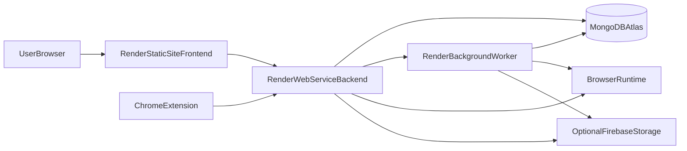

# Render Deployment Guide (Scout-X Scrapper)

This guide shows how to deploy Scout-X Scrapper on Render with production-safe defaults.

## Architecture overview



## Required inputs (before you start)

- Render account and linked Git repository
- MongoDB Atlas connection string (`MONGODB_URI`)
- Two public URLs:
  - frontend URL (for `PUBLIC_URL` / `VITE_PUBLIC_URL`)
  - backend URL (for `BACKEND_URL` / `VITE_BACKEND_URL`)
- Strong secrets:
  - `JWT_SECRET`
  - `SESSION_SECRET`
  - `ENCRYPTION_KEY` (64 hex chars recommended)
- Decide worker model:
  - recommended: separate worker service with `RUN_EMBEDDED_WORKERS=false`
- Optional integrations (only if needed):
  - Firebase service account and bucket settings
  - Redis values (optional in this architecture)
  - Browser runtime host/port overrides (`BROWSER_WS_*`, `CAMOUFOX_*`)

## Services to create on Render

Create these 3 services from the same repository:

1. Static Site: frontend
2. Web Service: backend API + sockets
3. Background Worker: queue and scraper worker

## 1) Frontend (Render Static Site)

- Root directory: repository root
- Build command:

```bash
npm ci && npm run build
```

- Publish directory:

```bash
build
```

- Environment variables:
  - `VITE_BACKEND_URL=https://<your-backend-domain>`
  - `VITE_PUBLIC_URL=https://<your-frontend-domain>`

## 2) Backend (Render Web Service)

- Root directory: repository root
- Build command:

```bash
npm ci && npm run build:server
```

- Start command:

```bash
npm run server
```

- Health check path:

```text
/
```

### Backend environment variables

Set at least:

- `NODE_ENV=production`
- `MONGODB_URI=<atlas-uri>`
- `JWT_SECRET=<strong-secret>`
- `SESSION_SECRET=<strong-secret>`
- `ENCRYPTION_KEY=<64-char-hex>`
- `BACKEND_URL=https://<your-backend-domain>`
- `PUBLIC_URL=https://<your-frontend-domain>`
- `VITE_BACKEND_URL=https://<your-backend-domain>`
- `VITE_PUBLIC_URL=https://<your-frontend-domain>`
- `RUN_EMBEDDED_WORKERS=false`
- `SCRAPER_WORKER_CONCURRENCY=3`
- `SCRAPER_JOB_TIMEOUT_MS=120000`
- `LOGS_PATH=server/logs`

Optional:

- `DEFAULT_PROXY_URL=`
- `PROXY_POOL=`
- `GOOGLE_CLIENT_ID=...`
- `GOOGLE_CLIENT_SECRET=...`
- `GOOGLE_REDIRECT_URI=...`
- `AIRTABLE_CLIENT_ID=...`
- `AIRTABLE_REDIRECT_URI=...`
- Firebase vars (if using cloud screenshot/object storage)
- Browser vars (`BROWSER_WS_HOST`, `BROWSER_WS_PORT`, `BROWSER_HEALTH_PORT`)
- Camoufox vars (`DEFAULT_BROWSER_TYPE=camoufox`, `CAMOUFOX_WS_*`)

## 3) Worker (Render Background Worker)

- Root directory: repository root
- Build command:

```bash
npm ci && npm run build:server
```

- Start command:

```bash
npm run worker
```

- Use the same env vars as backend for:
  - DB connection
  - secrets
  - browser runtime
  - optional storage integrations

## Connection rules (important)

- `PUBLIC_URL` must be the frontend origin exactly (used by CORS/session config).
- `BACKEND_URL` must be the backend origin exactly.
- `VITE_BACKEND_URL` should equal `BACKEND_URL`.
- `VITE_PUBLIC_URL` should equal `PUBLIC_URL`.
- If `RUN_EMBEDDED_WORKERS=false`, the background worker service must be running or jobs will stay queued.

## Browser strategy on Render

Start with default Playwright strategy:

- `DEFAULT_BROWSER_TYPE=playwright`
- No custom browser host vars unless you run a dedicated browser runtime

If you use remote browser runtime:

- Point `BROWSER_WS_HOST` / `BROWSER_HEALTH_PORT` to reachable host/ports
- Ensure backend and worker can reach that host

Camoufox:

- Use only if you intentionally run and maintain the Camoufox sidecar/runtime
- Set `DEFAULT_BROWSER_TYPE=camoufox` and `CAMOUFOX_WS_*` values

For anti-bot job boards (Microsoft, Amazon, etc.), use residential proxy settings (`DEFAULT_PROXY_URL` / `PROXY_POOL` + Proxy page config).

## Deployment checklist (step-by-step)

1. Create MongoDB Atlas database and verify network access.
2. Create Render backend web service with build/start commands above.
3. Add backend env vars and deploy.
4. Create Render background worker with build/start commands above.
5. Copy backend env vars to worker and deploy.
6. Create frontend static site, set `VITE_*` vars, and deploy.
7. Verify frontend can login and open dashboard.
8. Run one automation and confirm run progresses from queued to completed/failed with logs.

## Post-deploy verification

Backend checks:

- Open `https://<backend>/` and confirm it responds.
- Open `https://<backend>/api-docs` and confirm API docs load.

Functional checks:

- Login from frontend.
- Create/run one automation.
- Confirm queue events update dashboard.
- Open run details and confirm logs/screenshot sections update.
- Confirm schedule pause/resume works.

Worker checks:

- Ensure queued runs are consumed.
- Ensure retries/re-enqueues are visible in run logs.

## Troubleshooting

### 1) CORS/auth/session issues

Symptoms:

- Login fails or cookies not persisted
- API calls from frontend blocked

Fix:

- Ensure `PUBLIC_URL` exactly matches frontend origin
- Ensure `BACKEND_URL` and `VITE_BACKEND_URL` match backend origin
- Keep `NODE_ENV=production` and strong `SESSION_SECRET`

### 2) Runs stay queued

Symptoms:

- Automations enqueue but never start

Fix:

- Confirm worker service is running
- Confirm `RUN_EMBEDDED_WORKERS=false` on backend and worker exists
- Confirm backend and worker share same `MONGODB_URI`

### 3) Browser connection failures

Symptoms:

- `page.goto` network failures or browser startup errors

Fix:

- Start with default Playwright setup
- If using remote browser runtime, verify `BROWSER_WS_*` reachability
- For anti-bot targets, configure residential proxy

### 4) CAPTCHA-heavy targets (Microsoft/Amazon/etc.)

Symptoms:

- Frequent CAPTCHA in run logs

Fix:

- Configure residential proxy in Proxy settings
- Reduce run frequency
- Use adaptive retry/browser strategies already in worker logic

### 5) Optional Firebase storage not working

Symptoms:

- No uploaded screenshots/artifacts

Fix:

- Verify Firebase credential envs and bucket config
- If not needed, leave Firebase vars unset (app still runs)

## Rollback strategy

- Keep previous successful Render deploy as rollback target.
- If new deploy breaks:
  1. rollback backend service
  2. rollback worker service
  3. rollback frontend service
- Re-run one automation to verify queue + worker + UI path.

## Related docs

- [production-deployment.md](./production-deployment.md)
- [native-browser-setup.md](./native-browser-setup.md)
- [ENVEXAMPLE](../ENVEXAMPLE)
